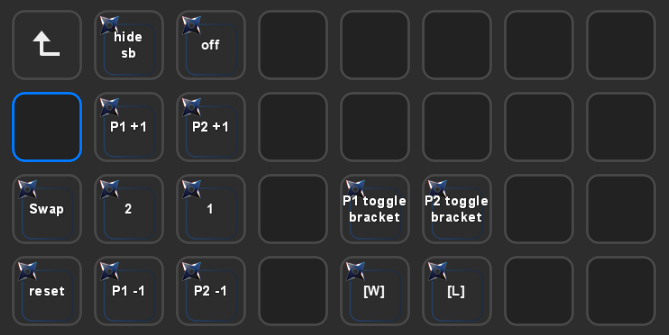

# Use the StreamDeck Plugin

Available at the [streamdeck-nodecg-melee-scoreboard](https://github.com/Jaggernaut555/streamdeck-nodecg-melee-scoreboard) repo.

# Below is an alternative method using an API plugin

# Example



These are using the API Ninja plugin from BarRaider. Each one's settings changed from default is described below.

# Scores

### Adding/subtracting from score
- Title: Anything you want
- Request Type: Post
- API URL: http://localhost:9090/api/v1/score
- Content Type: application/json
- Data:
```
{
    "team": 0,
    "operation": "add"
}
```
  - Use team `0` for left and team `1` for right
  - Use `add` or `subtract` to modify the score by 1 in that direction

### Display scores

- Title: *LEAVE EMPTY*
- Request Type: Post
- API URL: http://localhost:9090/api/v1/score
- Content Type: application/json
- Response shown: `score`
- Autorun every: 5 seconds
- Hide green success indicator: `true`
- Data:
```
{
    "team": 0,
    "operation": "get"
}
```
  - Use team `0` for left and team `1` for right

### Reset Scores
Set both scores to 0
- Title: Anything you want
- Request Type: Post
- API URL: http://localhost:9090/api/v1/reset

### Swap players
Swap player positions on the right/left side of the scoreboard
- Title: Anything you want
- Request Type: Post
- API URL: http://localhost:9090/api/v1/swap

# Bracket

### Toggle Winners/Losers
- Title: Anything you want
- Request Type: Post
- API URL: http://localhost:9090/api/v1/bracket
- Content Type: application/json
- Data:
```
{
    "team": 0,
    "operation": "toggle"
}
```
  - Use team `0` for left and team `1` for right

### Display bracket
- Title: *LEAVE EMPTY*
- Request Type: Post
- API URL: http://localhost:9090/api/v1/bracket
- Content Type: application/json
- Response shown: `bracket`
- Autorun every: 5 seconds
- Hide green success indicator: `true`
- Data:
```
{
    "team": 0,
    "operation": "get"
}
```
  - Use team `0` for left and team `1` for right

# Show/Hide Scoreboard

### Toggle on/off
- Title: Anything you want
- Request Type: Post
- API URL: http://localhost:9090/api/v1/scoreboard

### Display on/off
- Title: *LEAVE EMPTY*
- Request Type: Get
- API URL: http://localhost:9090/api/v1/scoreboard
- Response shown: `*`
- Autorun every: 5 seconds
- Hide green success indicator: `true`

# Twitch Predictions
This requires the twitch panel to be set up and showing `Valid Token: Yes`.

### Prediction
- Title: Anything you want
- Request Type: Post
- API URL: http://localhost:9090/api/v1/prediction
- Data:
```
{
    "operation": "progress"
}
```
  - valid operations are
    - `progress` - If no active prediction this will create one. If an active but not locked prediction this will lock it. If an active and locked prediction this will resolve it
    - `create` - Create a new prediction. The subtitle will be the title of the prediction
    - `lock` - End bet submissions
    - `resolve` - resolve the prediction and selects the team with the higher game count. If tied the prediction is not ended
    - `cancel` - cancels the current prediction

### Show Prediction Status
- Title: *LEAVE EMPTY*
- Request Type: Post
- API URL: http://localhost:9090/api/v1/prediction
- Content Type: application/json
- Response shown: `status`
- Autorun every: 5 seconds
- Hide green success indicator: `true`
- Data:
```
{
    "operation": "get"
}
```